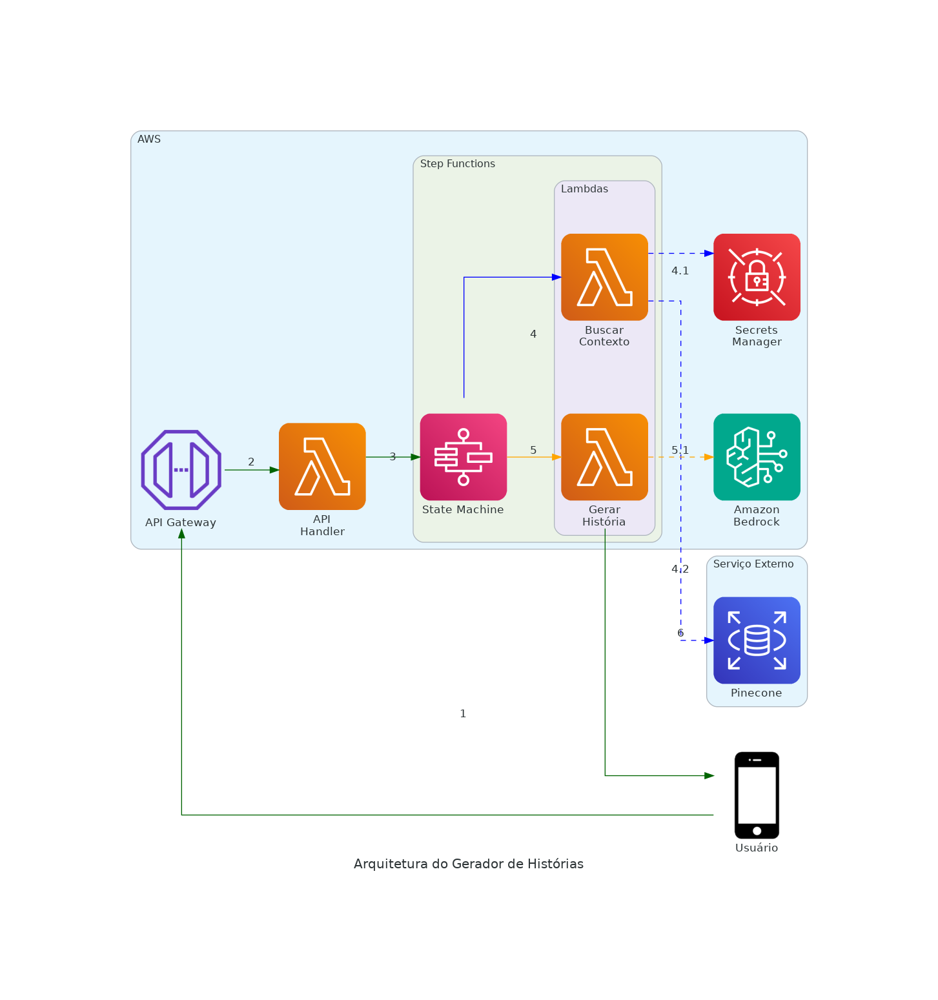
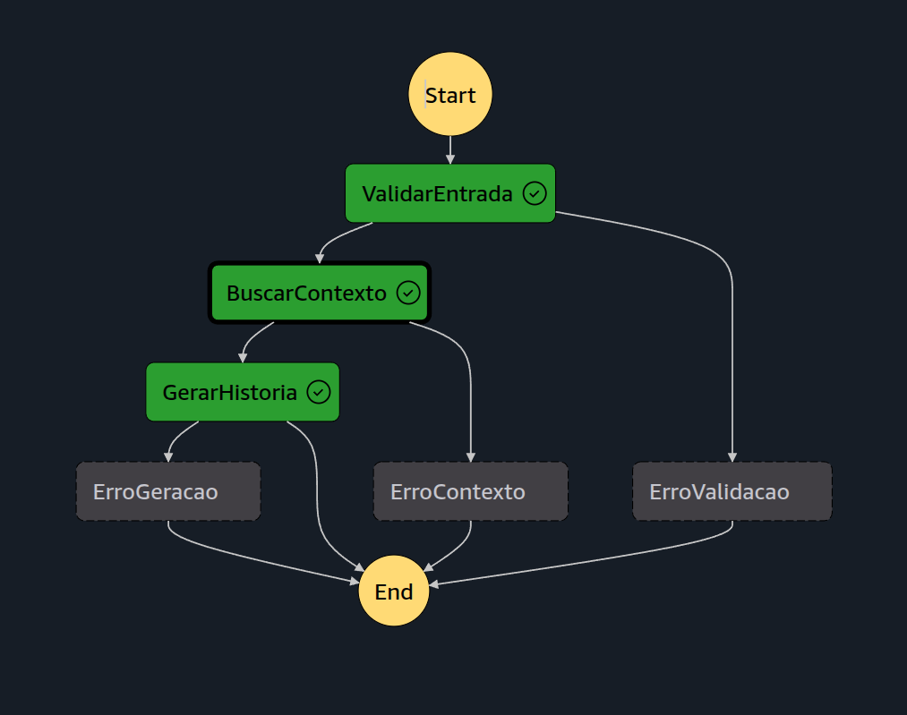

# Gerador de Histórias Star Wars 

Um gerador de histórias Star Wars usando AWS Step Functions, Amazon Bedrock e Pinecone para criar narrativas contextualizadas e envolventes.

## Sumário
1. [Visão Geral](#visão-geral)
2. [Estrutura do Projeto](#estrutura-do-projeto)
3. [Arquitetura](#arquitetura)
   - [Componentes](#componentes)
   - [Fluxo Detalhado da Requisição](#fluxo-detalhado-da-requisição)
   - [Orquestração via Step Functions](#orquestração-via-step-functions)
4. [Sistema de Geração de Histórias](#sistema-de-geração-de-histórias)
   - [Ingestão de Dados](#ingestão-de-dados)
   - [Retrieval Augmented Generation (RAG)](#retrieval-augmented-generation-rag)
   - [Modelo de Linguagem](#modelo-de-linguagem)
5. [Pré-requisitos](#pré-requisitos)
6. [Ingestão de Dados (Offline)](#ingestão-de-dados-offline)
7. [Configuração](#configuração)
8. [Deploy](#deploy)
9. [Uso da API](#uso-da-api)
10. [Monitoramento](#monitoramento)
11. [Limitações](#limitações)
12. [Contribuindo](#contribuindo)
13. [Licença](#licença)

## 1. Visão Geral

O Gerador de Histórias Star Wars é uma aplicação que combina o poder dos Large Language Models (LLMs) com uma base de conhecimento rica e precisa sobre o universo Star Wars para criar histórias envolventes e canonicamente precisas.

## 2. Estrutura do Projeto
```
pod_case/
├── ingest/                      # Scripts de ingestão offline
│   ├── ingest_data.py          # Script principal de ingestão no Pinecone
│   ├── swapi_preprocessor.py    # Preprocessamento da SWAPI
│   ├── ingest_personality.py    # Ingestão de biografias de personagens
│   └── requirements.txt         # Dependências para ingestão
│
└── story-generator/             # Aplicação principal
    ├── src/
    │   └── lambdas/            # Funções Lambda AWS
    │       ├── api/            # API Handler principal
    │       ├── fetch_context/  # Lambda de busca no Pinecone
    │       └── generate_story/ # Lambda de geração com Bedrock
    │
    └── generate_diagram.py     # Gerador do diagrama de arquitetura
```

## 3. Arquitetura

### 3.1 Componentes


A aplicação utiliza uma arquitetura serverless na AWS, com os seguintes componentes:
- **API Gateway**: Interface RESTful para receber requisições
- **API Handler**: Gerencia requisições e inicia o fluxo de geração
- **Step Functions**: Orquestrador do fluxo de geração
- **Lambda Functions**: 
  - `BuscarContexto`: Recupera informações do Pinecone
  - `GerarHistoria`: Gera história usando Bedrock
- **Amazon Bedrock**: LLM para geração de texto
- **Pinecone**: Base de conhecimento vetorial
- **Secrets Manager**: Gerenciamento seguro de credenciais

### 3.2 Fluxo Detalhado da Requisição

1. **Requisição do Usuário** → **API Gateway**
   - Usuário envia POST para `/historia` com personagens, planetas e naves
   - API Gateway valida o formato básico da requisição
   - Requisição é encaminhada para a Lambda API

2. **Lambda API** → **Step Functions**
   - Lambda API recebe a requisição do API Gateway
   - Valida e formata os parâmetros
   - Inicia nova execução do Step Function
   - Retorna ID da execução para o usuário
   - Também expõe endpoint GET `/historia/{pedido_id}` para consulta de status

3. **Orquestração** → **Step Functions**
   - Step Function inicia nova execução com os parâmetros
   - Primeiro estado (ValidarEntrada) verifica campos obrigatórios
   - Se validação falha, retorna erro 400 imediatamente

4. **Busca de Contexto** → **Lambda FetchContext**
   - Step Function invoca Lambda FetchContext
   - Lambda recupera credenciais do Pinecone do Secrets Manager
   - Constrói query combinando todos os elementos da história
   - Consulta Pinecone para obter contexto relevante
   - Retorna contexto estruturado para o Step Function

5. **Geração da História** → **Lambda GenerateStory**
   - Step Function invoca Lambda GenerateStory com o contexto
   - Lambda constrói prompt rico usando o contexto obtido
   - Invoca Amazon Bedrock (Claude) para gerar história
   - Aplica pós-processamento se necessário
   - Retorna história gerada para o Step Function

6. **Retorno ao Usuário** → **API Gateway**
   - Step Function conclui execução com sucesso
   - História gerada é retornada via API Gateway
   - Usuário recebe a história em formato JSON

### 3.3 Tratamento de Erros

1. **Erro de Validação**
   - Campos ausentes ou inválidos
   - Retorna 400 Bad Request com detalhes

2. **Erro de Contexto**
   - Falha ao acessar Pinecone
   - Credenciais inválidas
   - Retorna 500 Internal Error

3. **Erro de Geração**
   - Falha no Bedrock
   - Timeout na geração
   - Retorna 500 Internal Error

### 3.4 Orquestração via Step Functions


O Step Functions orquestra o fluxo completo com os seguintes estados:

1. **ValidarEntrada**: Valida se a requisição contém todos os campos necessários:
   - `personagens`: lista de personagens
   - `planetas`: lista de planetas
   - `naves`: lista de naves
   - Em caso de erro, transiciona para `ErroValidacao`

2. **BuscarContexto**: Invoca a Lambda `FetchContext` que:
   - Recupera credenciais do Pinecone do Secrets Manager
   - Busca informações relevantes sobre personagens, planetas e naves
   - Em caso de erro, transiciona para `ErroContexto`

3. **GerarHistoria**: Invoca a Lambda `GenerateStory` que:
   - Utiliza o contexto obtido para criar um prompt rico
   - Chama o Amazon Bedrock para gerar a história
   - Em caso de erro, transitiona para `ErroGeracao`

4. **Estados de Erro**:
   - `ErroValidacao`: Retorna erro 400 com campos inválidos
   - `ErroContexto`: Retorna erro 500 se falhar ao buscar contexto
   - `ErroGeracao`: Retorna erro 500 se falhar ao gerar história

## 4. Sistema de Geração de Histórias

### 4.1 Ingestão de Dados
O sistema é alimentado com dados canônicos do universo Star Wars provenientes de duas fontes principais:
1. **SWAPI (Star Wars API)**:
   - Informações básicas sobre personagens, planetas e naves
   - Dados sobre espécies, veículos e filmes
   - Relacionamentos entre entidades

2. **Wookieepedia**:
   - Biografias detalhadas dos personagens
   - História completa dos planetas
   - Especificações técnicas das naves
   - Eventos canônicos e suas cronologias

### 4.2 Retrieval Augmented Generation (RAG)
O sistema utiliza RAG para garantir que as histórias geradas sejam precisas e coerentes com o cânone Star Wars:

1. **Vetorização**:
   - Textos são convertidos em embeddings usando modelo especializado
   - Embeddings são armazenados no Pinecone para busca eficiente
   - Metadados preservam informações sobre fontes e relacionamentos

2. **Recuperação de Contexto**:
   - Consulta combina personagens, planetas e naves solicitados
   - Pinecone retorna os fragmentos mais relevantes
   - Sistema prioriza informações canônicas e relacionamentos estabelecidos

3. **Geração Aumentada**:
   - Contexto recuperado é estruturado em um prompt rico
   - Informações garantem consistência com o cânone
   - Sistema preserva personalidades e relações entre personagens

### 4.3 Modelo de Linguagem
O sistema utiliza o Amazon Bedrock para geração de texto, aproveitando:
- **Modelo Base**: Claude 2.1 (Anthropic)
- **Características**:
  - Compreensão profunda de contexto
  - Geração coerente e criativa
  - Respeito às regras do universo Star Wars
  - Contexto de 100k tokens
  - Saída de até 4096 tokens
  - Baixa latência (5-15 segundos)
- **Prompt Engineering**:
  - Templates especializados por tipo de história
  - Instruções para manter consistência com o cânone
  - Controle de tom e estilo narrativo
  - Sistema de poucos disparos (few-shot) para exemplos
  - Formatação estruturada do contexto recuperado

## 5. Pré-requisitos

1. AWS CLI configurada
2. AWS SAM CLI instalado
3. Python 3.10 ou superior
4. Conta no Pinecone
5. Acesso ao Amazon Bedrock

## 6. Ingestão de Dados (Offline)

A ingestão de dados é um processo offline que deve ser executado antes do deploy da aplicação. Este processo popula a base de conhecimento no Pinecone com informações do universo Star Wars.

### 6.1 Estrutura de Arquivos
```
ingest/
├── ingest_data.py         # Script principal de ingestão
├── ingest_personality.py  # Ingestão de personalidades
├── swapi_preprocessor.py  # Pré-processamento dos dados da SWAPI
└── requirements.txt       # Dependências para ingestão
```

### 6.2 Instalação de Dependências

1. Crie um ambiente virtual (recomendado):
```bash
cd ingest  # A partir da raiz do projeto
python -m venv venv
source venv/bin/activate  # Linux/Mac
# ou
venv\Scripts\activate     # Windows
```

2. Instale as dependências:
```bash
pip install -r requirements.txt
```

As dependências incluem:
- `requests`: Para chamadas à SWAPI
- `beautifulsoup4`: Para scraping da Wookieepedia
- `pandas`: Para manipulação de dados
- `pinecone-client`: Para interação com Pinecone
- `sentence-transformers`: Para geração de embeddings
- `mediawiki`: Para acesso à API da Wookieepedia
- `python-dotenv`: Para gerenciamento de variáveis de ambiente
- `tqdm`: Para barras de progresso
- `aiohttp`: Para requisições assíncronas

### 6.3 Ordem de Execução

1. **Pré-processamento da SWAPI**:
```bash
cd ingest
python swapi_preprocessor.py
```
Este script:
- Coleta dados da SWAPI (Star Wars API)
- Estrutura informações básicas de personagens, planetas e naves
- Gera arquivo intermediário para próxima etapa

2. **Ingestão de Personalidades**:
```bash
python ingest_personality.py
```
Este script:
- Busca biografias detalhadas da Wookieepedia
- Enriquece dados com características de personalidade
- Prepara contexto para geração de histórias mais ricas

3. **Ingestão Principal**:
```bash
python ingest_data.py
```
Este script:
- Combina dados da SWAPI e Wookieepedia
- Gera embeddings usando modelo especializado
- Carrega vetores e metadados no Pinecone

### 6.4 Verificação

Após a ingestão, verifique se:
1. Todos os scripts executaram sem erros
2. O índice Pinecone foi populado corretamente
3. Os metadados estão preservados

### 6.5 Observações Importantes

- A ingestão é um processo **offline** e deve ser executado apenas uma vez
- Requer conexão estável com internet devido ao volume de dados
- Pode levar várias horas dependendo do volume de dados
- Mantenha backups dos dados intermediários gerados
- Monitore o uso de recursos do Pinecone durante a ingestão

## 7. Configuração

1. Clone o repositório:
```bash
git clone <repository-url>
cd story-generator
```

2. Configure as credenciais do Pinecone no AWS Secrets Manager:
```bash
aws secretsmanager create-secret --name myproject/starwars \
  --secret-string '{"PINECONE_API_KEY":"sua-chave-api","PINECONE_ENV":"seu-ambiente"}'
```

3. Instale as dependências das Lambdas:
```bash
cd src/lambdas/fetch_context
pip install -r requirements.txt -t .
cd ../generate_story
pip install -r requirements.txt -t .
```

## 8. Deploy

1. Build do projeto:
```bash
sam build
```

2. Deploy na AWS:
```bash
sam deploy --guided
```

Durante o deploy guiado, você precisará fornecer:
- Stack Name: nome do seu stack (ex: story-generator)
- AWS Region: região onde o serviço será deployado
- Environment: ambiente (staging/production)

## 9. Uso da API

### Gerar uma História

**Request:**
```bash
curl -X POST https://sua-api.execute-api.region.amazonaws.com/staging/historia \
  -H "Content-Type: application/json" \
  -d '{
    "personagens": ["Luke Skywalker", "Darth Vader"],
    "planetas": ["Tatooine"],
    "naves": ["X-Wing"]
  }'
```

**Response:**
```json
{
  "historia": "Era uma vez em Tatooine, onde Luke Skywalker..."
}
```

### Códigos de Erro

- **400 Bad Request**: Campos inválidos ou faltando
- **500 Internal Error**: Erro ao buscar contexto ou gerar história

## 10. Monitoramento

- **CloudWatch Logs**: Logs das Lambdas
- **Step Functions Console**: Visualização e debug do fluxo
- **CloudWatch Metrics**: Métricas de execução

## 11. Limitações

1. **Amazon Bedrock**:
   - Limite de tokens por requisição
   - Latência média de 5-15 segundos

2. **Pinecone**:
   - Limites de QPS (queries por segundo)
   - Tamanho máximo dos vetores

## 12. Contribuindo

1. Fork o repositório
2. Crie uma branch para sua feature
3. Commit suas mudanças
4. Push para a branch
5. Crie um Pull Request

## 13. Licença

Este projeto está licenciado sob a licença MIT - veja o arquivo [LICENSE](LICENSE) para detalhes.
